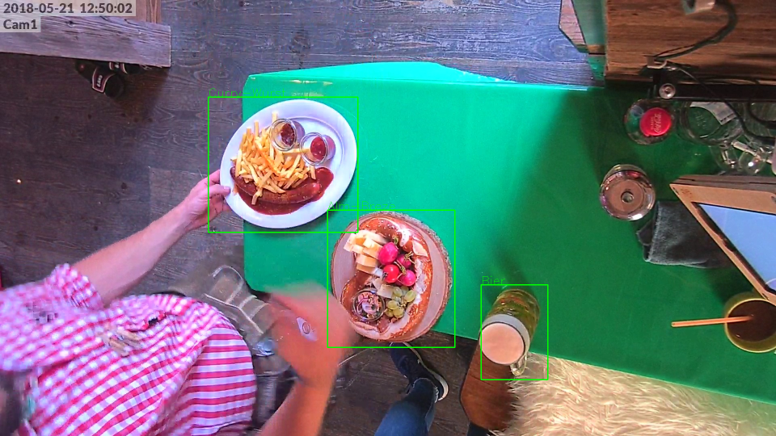

# Oktoberfest Food Dataset
## Description
The data was aquired during Schanzer Almfest at Ingolstadt in 2018 by [IlassAG](https://www.ilass.com). As a part of a practical at the [Data Mining and Analytics Chair by Prof. Günnemann at TUM](https://www.kdd.in.tum.de) we've been given the task to count objects at checkout. Therefore we annotated the data with bounding boxes and classes to train an object detection network.

<!---
## Task
Throughout this practical we aimed to implement, test and evaluate approaches to solve the problem of counting food items at checkout. You'll find code we used in this repository. However, note that it is not straight forward to use as data and models are due to their storage size not apparent. 
## Structure
This repository is divided to several subfolder to maintain structure. 
1. [submission_julius_alex](submission_julius_alex) \
This folder contains most important scripts @ga78yah and @ga78veb created, including Annotation, Evaluation and further approaches. 
2. [scripts_from_tfrepo](scripts_from_tfrepo) \
This contains files from the [repository](https://github.com/tensorflow/models/tree/master/research/object_detection) we used for training models.
3. [miscellaneous](miscellaneous) \
Here is very different code that is not necessary or outdated, as well as some data examples.
4. [configs](configs) \
This folder contains configs that were used for training.
--->