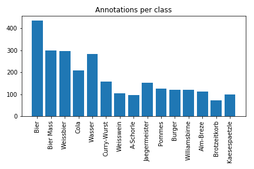

# Oktoberfest Food Dataset
The data was aquired during Schanzer Almfest at Ingolstadt in 2018 by [IlassAG](https://www.ilass.com). As a part of a practical at the [Data Mining and Analytics Chair by Prof. Günnemann at TUM](https://www.kdd.in.tum.de) we were given the task to count objects at checkout. Therefore we annotated the data with bounding boxes and classes to train an object detection network.


## Download
You can find the dataset [here](https://mediatum.ub.tum.de/1487154)
- `dataset` contains the train and test datasets including the labels
  - the labels can be found in `files.txt` (OpenCV style)
  - `<filename> <number of objects> <classid1> <x1> <y1> <w1> <h1> <classid2> <x2> <y2> <w2> <h2> ...`
- `models` contains our pretrained tensorflow models (see [Preview.ipynb](Preview.ipynb) for an example usage)
- `video_data_zipped` contains the raw videos from which the dataset were extracted

## Citation
If you find this work useful you may consider citing our [paper](https://arxiv.org/abs/1912.05007)
```
@misc{tum2019oktoberfest,
    title={Oktoberfest Food Dataset},
    author={Alexander Ziller and Julius Hansjakob and Vitalii Rusinov and Daniel Z\"ugner and Peter Vogel and Stephan G\"unnemann},
    year={2019},
    eprint={1912.05007},
    archivePrefix={arXiv},
    primaryClass={cs.CV}
}
```

## Dataset Description


### Data Distribution

Class Id | Class | Images | Annotations | average quantity
 --- | --- | --- | --- | ---
0 | Bier | 300 | 436 | 1.45 
1 | Bier Mass | 200 | 299 | 1.50 
2 | Weissbier | 229 | 298 | 1.30 
3 | Cola | 165 | 210 | 1.27 
4 | Wasser | 198 | 284 | 1.43 
5 | Curry-Wurst | 120 | 159 | 1.32 
6 | Weisswein | 81 | 105 | 1.30 
7 | A-Schorle | 90 | 98 | 1.09 
8 | Jaegermeister | 43 | 152 | 3.53 
9 | Pommes | 110 | 126 | 1.15 
10 | Burger | 105 | 122 | 1.16 
11 | Williamsbirne | 50 | 121 | 2.42 
12 | Alm-Breze | 100 | 114 | 1.14 
13 | Brotzeitkorb | 65 | 72 | 1.11 
14 | Kaesespaetzle | 92 | 100 | 1.09 
  || Total | 1110 | 2696 | 2.43

### Statistics

 \
 \
 \


## Benchmark
For training object detection models we used [tensorflow's Object Detection API](https://github.com/tensorflow/models/tree/master/research/object_detection). We trained several different approaches and got best results for a Single Shot Detector (SSD) with Feature Pyramid Networks (FPN). Our evaluation metric was the area under the precision-recall curve on a test set of 86 images (as our goal was to count we ignored the localization). 

Approach | Backbone model | Area | Example precision@recall
 --- | --- | --- | ---
[SSD](https://dataserv.ub.tum.de/index.php/s/m1487154/download?path=/models&files=ssd.pb) | Mobilenet | 0.86 | 0.85@0.70
[SSD + FPN](https://dataserv.ub.tum.de/index.php/s/m1487154/download?path=/models&files=ssd_fpn.pb) | Mobilenet | 0.98 | 0.97@0.97
[RFCN](https://dataserv.ub.tum.de/index.php/s/m1487154/download?path=/models&files=rfcn.pb) | ResNet-101 | 0.965 | 0.90@0.95

<!--- Faster RCNN (PyTorch Version) | VGG-16 | 0.95 | 0.90@0.92 --->

## Code
The [Evaluation](evaluation) folder contains Jupyter notebooks to evaluate the TensorFlow models.

With the [Preview](Preview.ipynb) notebook one can try out the pretrained TensorFlow models on arbitrary images.

The [CreateTFRecordFile](CreateTFRecordFile.ipynb) notebook contains code to convert the dataset in to the TFRecord file format so it can be used with the TensorFlow object detection library.

The [ShowAnnotations](ShowAnnotations.py) visualizes the bounding boxes of the dataset. Use 'n' for the next image, 'p' for the previous and 'q' to quit. 

## PASCAL_VOC format
This was done by [Vitalii Rusinov](https://github.com/vitaliy-rusinov) and is further explained in his [fork](https://github.com/vitaliy-rusinov/OktoberfestFoodDataset).

[Images](https://drive.google.com/open?id=1rgJUEFB4Cmbf9mQVdGPCHGiT4bvh_gDT)

[Video](https://drive.google.com/open?id=1mLIc1Ybs1rVwzMDuWMwxWUgl7spx2tBB)

In addition, the labels in the PASCAL_VOC format are available in the [PASCAL_VOC folder](PASCAL_VOC).

Online Notebooks to train Faster RCNN and Retinanet models on the dataset using Google Colaboratory are available here

[Faster RCNN Pytorch](https://drive.google.com/open?id=1CDQ5cIA8qsdm-OinbfPKM5DuoI6ewvZH)

[RetinaNet Tensorflow](https://drive.google.com/open?id=1KxP-j0TSQ_PY7xkJ4JNRyMnLv7kjRB_e)


## Authors
[Alexander Ziller](https://github.com/a1302z): Student of Robotics, Cognition & Intelligence (M.Sc.) at TUM \
[Julius Hansjakob](https://github.com/polarbart): Student of Informatics (M.Sc.) at TUM \
[Vitalii Rusinov](https://github.com/vitaliy-rusinov): Student of Informatics (M.Sc.) at TUM 

We also want to credit [Daniel Zügner](https://github.com/danielzuegner) for his efforts. 
